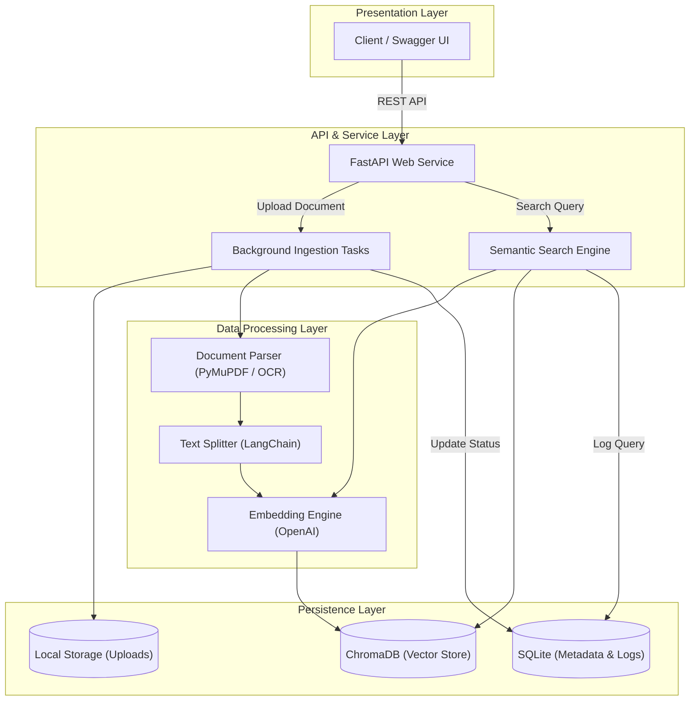

# Internal AI Knowledge Platform

Minimal backend submission for uploading documents and code, embedding their chunks, and retrieving relevant chunks with semantic search.

## Stack

- FastAPI API service
- LangChain text splitters, OpenAI embeddings, and Chroma integration
- Persistent local Chroma vector store
- SQLite metadata and query logs
- PyMuPDF PDF extraction with Tesseract OCR fallback for scanned or image-based pages

The provided `Knowledge_Base_Sample (2).pdf` is image-based, so OCR is required for usable retrieval from it.

## Architecture



## Setup

```bash
python3 -m venv .venv
source .venv/bin/activate
pip install -r requirements.txt
export OPENAI_API_KEY=your_key
uvicorn main:app --reload
```

Tesseract must be installed for OCR fallback. On macOS:

```bash
brew install tesseract
```

The API docs are available at `http://127.0.0.1:8000/docs`.

## API Flow

Upload the task PDF:

```bash
curl -X POST http://127.0.0.1:8000/documents \
  -F 'file=@Knowledge_Base_Sample (2).pdf'
```

Upload the task code file:

```bash
curl -X POST http://127.0.0.1:8000/documents \
  -F 'file=@Source_Code_Sample (2).py'
```

Poll each returned document id:

```bash
curl http://127.0.0.1:8000/documents/<document_id>
```

Query the code sample:

```bash
curl -X POST http://127.0.0.1:8000/query \
  -H 'Content-Type: application/json' \
  -d '{
    "query": "What happens when report_failure is called for a failed proxy?",
    "top_k": 3,
    "filters": {"file_type": "py"}
  }'
```

Query the PDF:

```bash
curl -X POST http://127.0.0.1:8000/query \
  -H 'Content-Type: application/json' \
  -d '{
    "query": "Why are enterprises adopting AI orchestration instead of traditional integration?",
    "top_k": 3,
    "filters": {"file_type": "pdf"}
  }'
```

Delete a document:

```bash
curl -X DELETE http://127.0.0.1:8000/documents/<document_id>
curl -X DELETE 'http://127.0.0.1:8000/documents/<document_id>?hard=true'
```

## Submission Proof

Capture Swagger UI or curl screenshots that show:

1. Both task files uploaded through `POST /documents`
2. Both documents reaching `ready` with non-zero `chunk_count`
3. A code query returning the `report_failure` chunk
4. A PDF query returning OCR-derived content about AI orchestration
5. One filtered query with `file_type` set to `py` or `pdf`

## Docs

- [API specification](docs/api_specification.md)
- [Database schema](docs/database_schema.md)
- [Semantic search design](docs/semantic_search_design.md)
- [Scaling strategy](docs/scaling_strategy.md)
