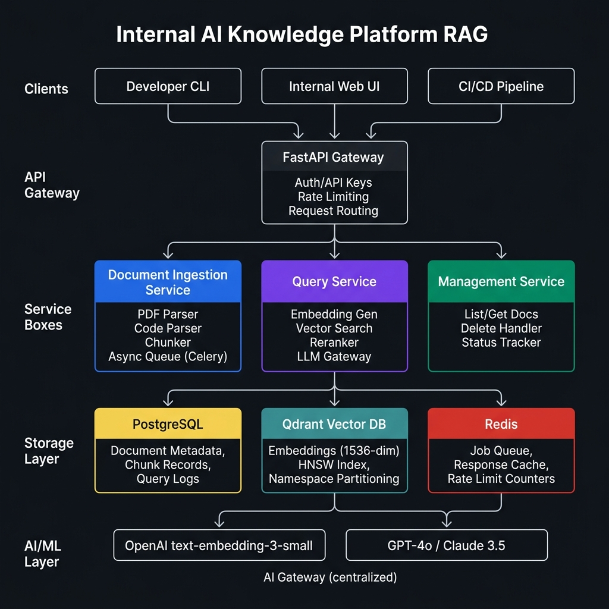

# Internal AI Knowledge Platform

**Submitted by:** Himanshu Wagh | Python Developer | May 21, 2026

---

## What this is

A backend RAG system that lets internal developers upload documents and code files, then query them using natural language. Built for ~100 developers.

**Knowledge base used in this submission:**
- `Knowledge_Base_Sample.pdf` — document RAG
- `Source_Code_Sample.py` — code-base RAG

---

## Stack

| Layer | Choice |
|---|---|
| API | FastAPI |
| Async jobs | Celery + Redis |
| Metadata DB | PostgreSQL |
| Vector DB | Qdrant |
| Embeddings | OpenAI `text-embedding-3-small` |
| LLM Gateway | GPT-4o / Claude 3.5 |

---

## Architecture

Three services behind a single API gateway:

- **Ingestion Service** — parses files, chunks them, generates embeddings async
- **Query Service** — embeds the query, runs vector search, reranks, returns results
- **Management Service** — list, status, delete documents

---

## APIs (quick reference)

| Method | Endpoint | What it does |
|---|---|---|
| `POST` | `/documents` | Upload a file (returns `job_id`, processes async) |
| `GET` | `/documents` | List all documents |
| `GET` | `/documents/{id}` | Get document + status |
| `DELETE` | `/documents/{id}` | Soft delete (default) or hard delete (`?hard=true`) |
| `POST` | `/query` | Semantic search over the knowledge base |
| `GET` | `/jobs/{id}` | Poll ingestion job progress |
| `GET` | `/health` | Health check |

Full spec → [`docs/api_specification.md`](docs/api_specification.md)

---

## Database

Four tables: `documents`, `chunks`, `query_logs`, `jobs`

Full schema → [`docs/database_schema.md`](docs/database_schema.md)

---

## How search works

1. PDF chunks split by paragraph (~512 tokens, 64 overlap)
2. Python code chunks split by function/class using AST
3. Each chunk embedded → stored in Qdrant
4. Query embedded → HNSW ANN search → cross-encoder reranking → top-K returned

Full design → [`docs/semantic_search_design.md`](docs/semantic_search_design.md)

---

## Scaling & trade-offs

Current setup is lean (2 documents, ~150 vectors). Architecture is ready to scale horizontally when needed.

Full write-up → [`docs/scaling_strategy.md`](docs/scaling_strategy.md)
