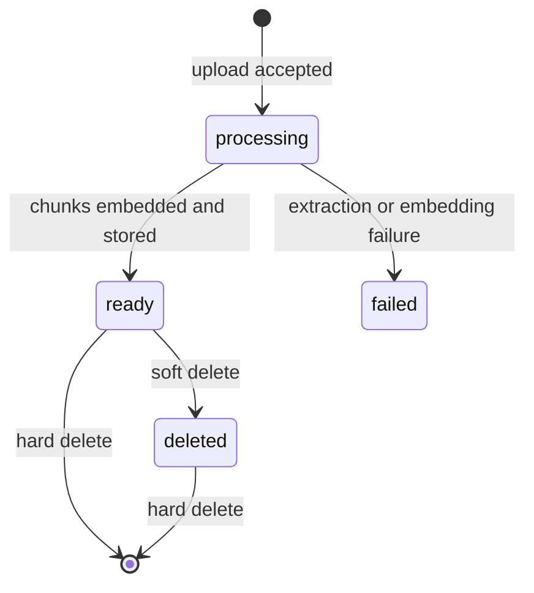

# API Specification

This API is intentionally retrieval-focused. It exposes the minimum surface needed to ingest files, observe ingestion state, search the knowledge base, and remove documents without hiding the RAG behavior behind a generated answer.

Local base URL: `http://127.0.0.1:8000`

## API Conventions

- File ingestion is asynchronous from the client perspective. Upload returns quickly with a document id and the caller polls status.
- Query results return source chunks and metadata. The caller can inspect the evidence used by semantic search.
- Uploaded content is scoped by document metadata in the vector store, so file-type and document-level filtering happen during retrieval.
- FastAPI returns standard validation errors for malformed requests and unsupported input fields.

## Document Lifecycle



## Upload Document

### `POST /documents`

Accepts one PDF, Python, text, or Markdown file using `multipart/form-data`.

| Field | Type | Required | Notes |
|---|---|---|---|
| `file` | file | yes | Supported extensions: `.pdf`, `.py`, `.txt`, `.md` |

Example:

```bash
curl -X POST http://127.0.0.1:8000/documents \
  -F 'file=@Knowledge_Base_Sample (2).pdf'
```

Response `202 Accepted`:

```json
{
  "document_id": "8f3cf205-10f0-43bd-a559-5a7a7637e3e4",
  "filename": "Knowledge_Base_Sample (2).pdf",
  "file_type": "pdf",
  "status": "processing"
}
```

The API persists the upload, creates the metadata row, and schedules ingestion. A successful upload response means the file was accepted for processing; it does not mean embeddings are already available.

Common failures:

| Status | Reason |
|---|---|
| `400` | File is empty |
| `422` | Unsupported file extension or malformed multipart request |

## Get Document Status

### `GET /documents/{document_id}`

Returns the current ingestion state for a single document.

Response `200 OK`:

```json
{
  "document_id": "8f3cf205-10f0-43bd-a559-5a7a7637e3e4",
  "filename": "Knowledge_Base_Sample (2).pdf",
  "file_type": "pdf",
  "status": "ready",
  "chunk_count": 29,
  "deleted": false,
  "error": null,
  "created_at": "2026-05-21T09:00:00+00:00"
}
```

Status values:

| Status | Meaning |
|---|---|
| `processing` | Content extraction, chunking, or embedding is in progress |
| `ready` | Chunks are available to query |
| `failed` | Ingestion stopped and `error` contains the failure summary |
| `deleted` | Document was soft deleted and is excluded from retrieval |
| `delete_failed` | Hard delete did not fully complete; metadata remains for recovery |

`404` is returned when the document id is unknown or has already been hard deleted.

## Query Knowledge

### `POST /query`

Embeds a natural-language query and returns the most relevant stored chunks.

Request:

```json
{
  "query": "What happens when report_failure is called for a failed proxy?",
  "top_k": 5,
  "filters": {
    "file_type": "py",
    "document_id": "optional-document-id"
  }
}
```

Request fields:

| Field | Required | Notes |
|---|---|---|
| `query` | yes | Natural-language retrieval query |
| `top_k` | no | Defaults to `5`; accepted range is `1` to `20` |
| `filters.file_type` | no | Limits results by stored file type |
| `filters.document_id` | no | Limits results to one uploaded document |

Response `200 OK`:

```json
{
  "query": "What happens when report_failure is called for a failed proxy?",
  "top_k": 5,
  "latency_ms": 124,
  "results": [
    {
      "rank": 1,
      "score": 0.82,
      "content": "def report_failure(self, proxy): ...",
      "document_id": "8ffcb08f-a952-4b8d-89ff-676e5e9b0976",
      "filename": "Source_Code_Sample (2).py",
      "file_type": "py",
      "metadata": {
        "document_id": "8ffcb08f-a952-4b8d-89ff-676e5e9b0976",
        "filename": "Source_Code_Sample (2).py",
        "file_type": "py",
        "chunk_index": 4,
        "is_deleted": false
      }
    }
  ]
}
```

The response is designed for validation and source inspection:

- `content` is the retrieved chunk, not an LLM summary.
- `metadata.page` is present for PDF chunks when page information exists.
- `score` is exposed as a similarity-style value derived from the vector-store distance returned by the implementation.
- Soft-deleted chunks are always excluded, even if the caller supplies a document id filter.

## Delete Document

### `DELETE /documents/{document_id}`

The default delete path is reversible at the vector-search level. Metadata remains in SQLite and vector records are marked deleted so they stop appearing in query results.

Response `200 OK`:

```json
{
  "document_id": "8f3cf205-10f0-43bd-a559-5a7a7637e3e4",
  "status": "soft_deleted",
  "deleted_at": "2026-05-21T09:15:00+00:00"
}
```

### `DELETE /documents/{document_id}?hard=true`

Hard delete removes Chroma records first, then deletes the SQLite document row. This order avoids reporting a clean metadata delete while orphan vectors remain searchable.

Response:

```json
{
  "document_id": "8f3cf205-10f0-43bd-a559-5a7a7637e3e4",
  "status": "hard_deleted"
}
```

If vector deletion fails, the metadata row is preserved and the endpoint returns an error. In a production worker-based design this path would be retried rather than relying on one request attempt.

## Health

### `GET /health`

Response:

```json
{
  "status": "ok"
}
```

This health endpoint is intentionally shallow for the assignment. A production readiness endpoint would also check persistence, vector-store availability, and dependency credentials without exposing secrets.
