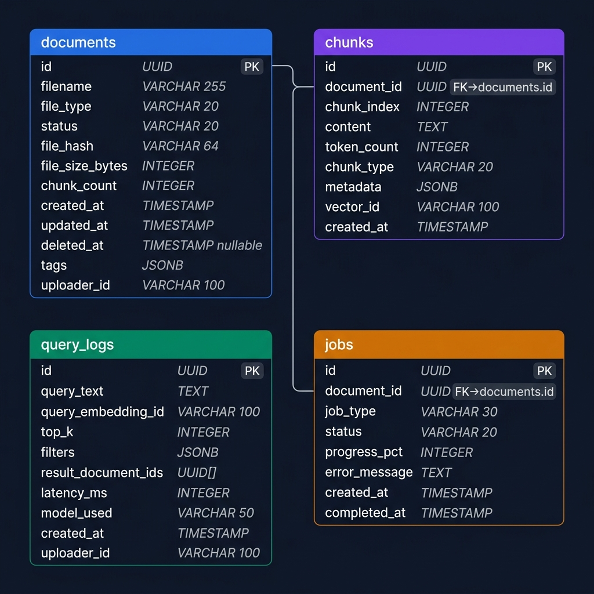

# Database Schema

---

## PostgreSQL — 4 tables



### documents

Stores one row per uploaded file.

```sql
CREATE TABLE documents (
    id              UUID PRIMARY KEY DEFAULT gen_random_uuid(),
    filename        VARCHAR(255) NOT NULL,
    file_type       VARCHAR(20) NOT NULL,       -- 'pdf', 'py', 'md', etc.
    status          VARCHAR(20) NOT NULL DEFAULT 'pending',
    file_hash       VARCHAR(64) NOT NULL UNIQUE, -- SHA-256, prevents duplicate uploads
    file_size_bytes INTEGER NOT NULL,
    chunk_count     INTEGER DEFAULT 0,
    tags            JSONB DEFAULT '[]',
    uploader_id     VARCHAR(100) NOT NULL,
    created_at      TIMESTAMPTZ DEFAULT NOW(),
    updated_at      TIMESTAMPTZ DEFAULT NOW(),
    deleted_at      TIMESTAMPTZ             -- NULL = active, non-NULL = soft deleted
);
```

Key indexes: `file_hash` (unique), `status` (partial, active only), `tags` (GIN).

---

### chunks

One row per chunk produced during ingestion. References the vector stored in Qdrant.

```sql
CREATE TABLE chunks (
    id            UUID PRIMARY KEY DEFAULT gen_random_uuid(),
    document_id   UUID NOT NULL REFERENCES documents(id) ON DELETE CASCADE,
    chunk_index   INTEGER NOT NULL,
    content       TEXT NOT NULL,
    token_count   INTEGER,
    chunk_type    VARCHAR(20) DEFAULT 'text',  -- 'text' or 'code'
    metadata      JSONB DEFAULT '{}',          -- page_number, class_name, function_name, etc.
    vector_id     VARCHAR(100) NOT NULL UNIQUE, -- Qdrant point ID
    is_deleted    BOOLEAN DEFAULT FALSE,
    created_at    TIMESTAMPTZ DEFAULT NOW()
);
```

`vector_id` is what we use to delete the right Qdrant points during hard delete.

---

### query_logs

Append-only log of every search request. Useful for debugging and usage analytics.

```sql
CREATE TABLE query_logs (
    id                  UUID PRIMARY KEY DEFAULT gen_random_uuid(),
    query_text          TEXT NOT NULL,
    top_k               INTEGER,
    filters             JSONB DEFAULT '{}',
    result_chunk_ids    UUID[],
    result_scores       FLOAT[],
    latency_ms          INTEGER,
    model_used          VARCHAR(50),
    rerank_applied      BOOLEAN DEFAULT FALSE,
    uploader_id         VARCHAR(100),
    created_at          TIMESTAMPTZ DEFAULT NOW()
);
```

---

### jobs

Tracks async ingestion (or hard delete) progress.

```sql
CREATE TABLE jobs (
    id              UUID PRIMARY KEY DEFAULT gen_random_uuid(),
    document_id     UUID NOT NULL REFERENCES documents(id),
    job_type        VARCHAR(30) DEFAULT 'ingest',   -- 'ingest' or 'hard_delete'
    status          VARCHAR(20) DEFAULT 'pending',
    progress_pct    INTEGER DEFAULT 0,
    current_step    VARCHAR(50),
    error_message   TEXT,
    retry_count     INTEGER DEFAULT 0,
    created_at      TIMESTAMPTZ DEFAULT NOW(),
    completed_at    TIMESTAMPTZ
);
```

---

## Qdrant — vector store

Collection: `knowledge_chunks`

```json
{
  "vectors": { "size": 1536, "distance": "Cosine" },
  "hnsw_config": { "m": 16, "ef_construct": 100 }
}
```

Each point stores the embedding + a payload mirror of the chunk metadata (file_type, tags, is_deleted, etc.). Filters run inside HNSW graph traversal — no extra DB round-trip at query time.

---

## Caching (Redis)

| What | Key | TTL |
|---|---|---|
| Query results | `sha256(query + filters)` | 5 min |
| Query embeddings | `sha256(query_text)` | 1 hour |
| Document list | `list:{uploader_id}` | 60 sec |
| Rate limit counters | `rate:{api_key}` | 60 sec |

Cache is invalidated on upload/delete for the list cache. Embedding and result caches expire naturally via TTL.
