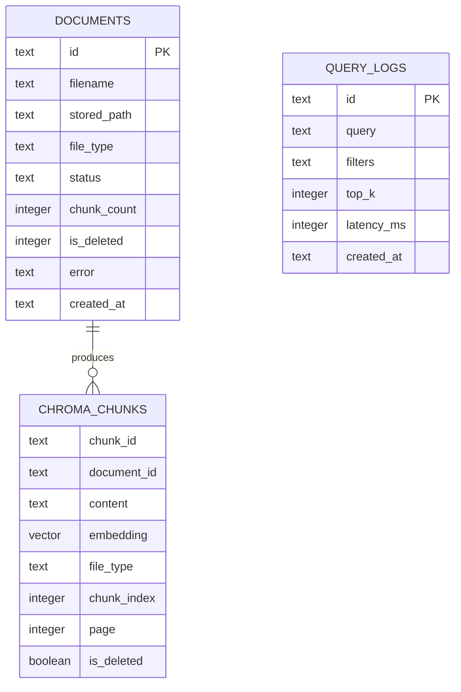

# Database Schema

The storage model separates operational metadata from retrieval data:

- SQLite tracks document state and lightweight query logs.
- Chroma owns chunk text, embeddings, and the metadata required to filter retrieval.

That split keeps the submission runnable with no external database service while preserving the main boundary a production RAG system needs: document lifecycle data should not be coupled to one vector-store implementation.

## Data Model



## SQLite Metadata

### `documents`

```sql
CREATE TABLE documents (
    id TEXT PRIMARY KEY,
    filename TEXT NOT NULL,
    stored_path TEXT NOT NULL,
    file_type TEXT NOT NULL,
    status TEXT NOT NULL,
    chunk_count INTEGER NOT NULL DEFAULT 0,
    is_deleted INTEGER NOT NULL DEFAULT 0,
    deleted_at TEXT,
    error TEXT,
    created_at TEXT NOT NULL,
    updated_at TEXT NOT NULL
);
```

The document row is the lifecycle record for an upload. It answers questions such as:

- Was the file accepted and where was it stored?
- Is it still processing, ready to query, failed, or deleted?
- How many chunks were indexed?
- What ingestion error should be shown to the caller if processing fails?

The current API reads documents by id and updates one row per ingestion or deletion transition. SQLite is a reasonable choice here because the assignment workload has low write concurrency and the service is intentionally single-node.

### `query_logs`

```sql
CREATE TABLE query_logs (
    id TEXT PRIMARY KEY,
    query TEXT NOT NULL,
    filters TEXT NOT NULL,
    top_k INTEGER NOT NULL,
    latency_ms INTEGER NOT NULL,
    created_at TEXT NOT NULL
);
```

Query logging is kept small on purpose. It records enough context to inspect retrieval usage and latency without storing generated answers or duplicating returned chunks. In a larger system, query logs also become a useful input for evaluation sets and retrieval-quality reviews.

## Chroma Retrieval Records

Collection: `knowledge_chunks`

| Data | Stored as | Why |
|---|---|---|
| Chunk body | Chroma document | Returned directly in query results |
| Embedding | Chroma vector | Used for semantic similarity search |
| `document_id` | metadata | Connects each chunk to its document lifecycle row |
| `filename` | metadata | Makes query results readable without a metadata round trip |
| `file_type` | metadata | Supports PDF/code filtering |
| `chunk_index` | metadata | Preserves deterministic chunk ordering within a file |
| `page` | metadata when present | Provides source location for PDF chunks |
| `is_deleted` | metadata | Excludes soft-deleted content during retrieval |

Chunk ids are generated from document id and chunk index. That gives deterministic ids within one ingestion attempt and makes delete/update operations straightforward for the assignment implementation.

## Query Patterns

The dominant paths are simple:

1. `POST /documents` inserts one document row, then writes many vector records after chunking.
2. `GET /documents/{id}` reads one lifecycle row by primary key.
3. `POST /query` searches Chroma with metadata filters and appends one query log row.
4. Soft delete updates the document row and marks that document's Chroma records deleted.
5. Hard delete removes Chroma records before removing the document row.

Keeping file type, document id, and delete state inside vector metadata avoids a database join on every retrieval request.

## Operational Considerations

For this implementation, persistence is local:

- SQLite is created under `.rag_data/metadata.db`.
- uploaded files are stored under `.rag_data/uploads/`.
- Chroma data is stored under `.rag_data/chroma/`.

That makes local review simple. It also means this repository does not claim durability across machines or horizontal API replicas.

## Production Evolution

At production scale I would keep the same logical ownership but change the backing services:

| Current submission | Production direction |
|---|---|
| Local uploads | Object storage with content hash and retention policy |
| SQLite document state | PostgreSQL with lifecycle indexes and migrations |
| Local Chroma | Production vector store with backups, filtering, and capacity monitoring |
| In-process query logs | Durable analytics/event path if query volume justifies it |

The first useful PostgreSQL indexes would be document status, delete state, creation time, and a uniqueness key for content deduplication if repeated uploads become common.
