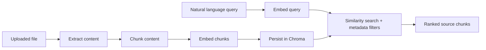

# Semantic Search Design

## Retrieval Goal

The search service is designed to return the best source chunks for a developer question. It does not generate an answer in this submission because the assignment validation is about ingestion quality, embedding flow, vector search, metadata filtering, and evidence retrieval.

That keeps the result inspectable:

- a code query should return the relevant code region
- a document query should return the source text extracted from the PDF
- filters should visibly restrict the result set

## Pipeline

## Content Extraction

### PDF input

PDF extraction is handled page by page:

1. try normal PyMuPDF text extraction
2. if the page has too little text, use OCR through PyMuPDF and Tesseract
3. keep page metadata on the extracted content

This matters for the provided `Knowledge_Base_Sample (2).pdf`. It contains visible text but does not provide a useful text layer for ordinary PDF extraction, so an OCR fallback is necessary for semantic retrieval to work.

OCR is treated as a fallback rather than the default because it is slower and can introduce recognition noise.

### Code and text input

Python, text, and Markdown uploads are decoded as source text. Python files use LangChain's Python-aware recursive splitter so code boundaries are handled better than a naive fixed-width split. Text and Markdown use the general recursive splitter.

## Chunking Strategy

Current settings:

| Input | Strategy | Chunk size | Overlap |
|---|---|---|---|
| PDF page text | Recursive text split | 1200 characters | 180 characters |
| Python source | Python-aware recursive split | 1200 characters | 180 characters |
| Text/Markdown | Recursive text split | 1200 characters | 180 characters |

The goal is to keep chunks large enough to preserve local meaning while small enough to return focused evidence. Overlap reduces boundary loss when a relevant idea starts near the end of one chunk and continues into the next.

For this assignment, character-based sizing is a practical choice. In a larger corpus, chunk sizing should be evaluated against retrieval quality and embedding-model token limits rather than treated as a fixed constant forever.

## Embedding Lifecycle

Chunks and queries use the same embedding model: OpenAI `text-embedding-3-small`.

At ingestion time:

- each chunk is embedded
- the chunk body and embedding are stored in Chroma
- retrieval metadata is stored alongside the vector
- SQLite is updated with the final chunk count and document status

At query time:

- the query string is embedded
- Chroma searches nearby chunk vectors
- metadata filters are applied during retrieval
- the API returns ranked chunks and their metadata

Using the same embedding space for both content and questions is what allows semantic retrieval to find related text even when exact wording differs.

## Metadata Used During Search

Each vector record carries the metadata needed for retrieval and inspection:

| Metadata | Role |
|---|---|
| `document_id` | link results to one uploaded file and support document filtering |
| `filename` | make results readable to the caller |
| `file_type` | separate PDF retrieval from code retrieval when requested |
| `chunk_index` | preserve chunk identity within one document |
| `page` | provide PDF source location when available |
| `is_deleted` | exclude soft-deleted data |

The API exposes `file_type` and `document_id` filters because they are useful validation controls for the two task files and common controls in a knowledge platform.

## Ranking Behavior

The implementation returns Chroma similarity results in rank order and exposes a score derived from vector-store distance. This is sufficient to demonstrate semantic retrieval with source evidence.

There is no reranker in this submission. That is a deliberate complexity boundary:

- the corpus is small
- the assignment proof is focused on successful ingestion and retrieval
- reranking should be added only when retrieval evaluation shows top-K precision needs improvement

If the corpus grows or query quality becomes harder to control, likely next improvements are retrieval evaluation sets, reranking for ambiguous results, and better code-aware chunk metadata.

## Failure Handling And Quality Risks

| Risk | Current handling |
|---|---|
| Unsupported or empty upload | request rejected |
| PDF has no extractable text | OCR fallback attempted |
| Extraction still yields no chunks | document marked failed |
| Embedding or vector write fails | document marked failed with error summary |
| Deleted content appears in search | `is_deleted` filter is always applied |
| Query dependency fails | API returns an error rather than fabricated results |

The main quality risk for the supplied PDF is OCR noise. The system handles that operationally by making OCR possible; the practical validation is to query for known ideas from the PDF and inspect whether the returned chunk still contains enough readable source content to support the result.
